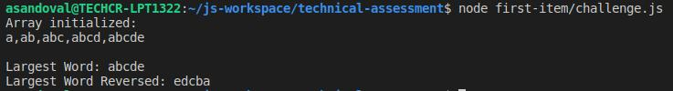
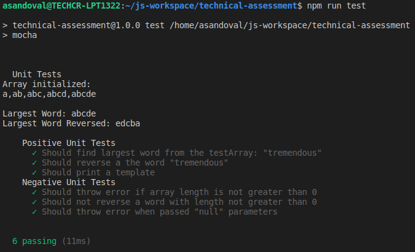
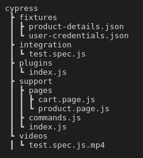
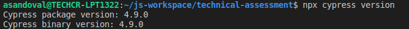
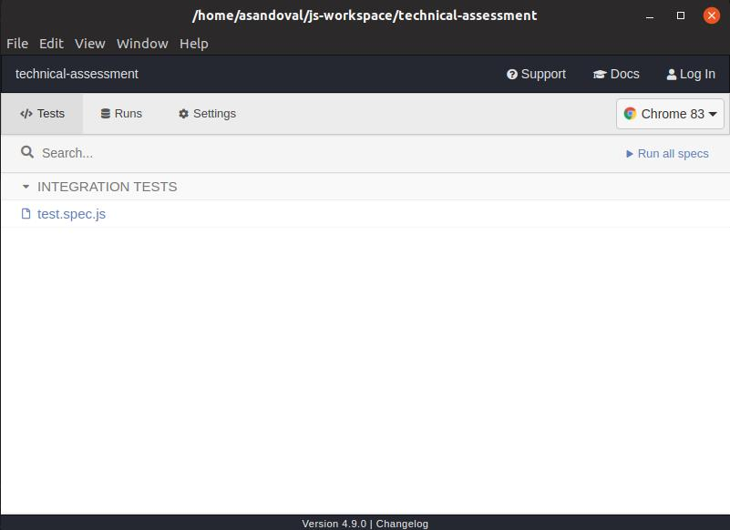
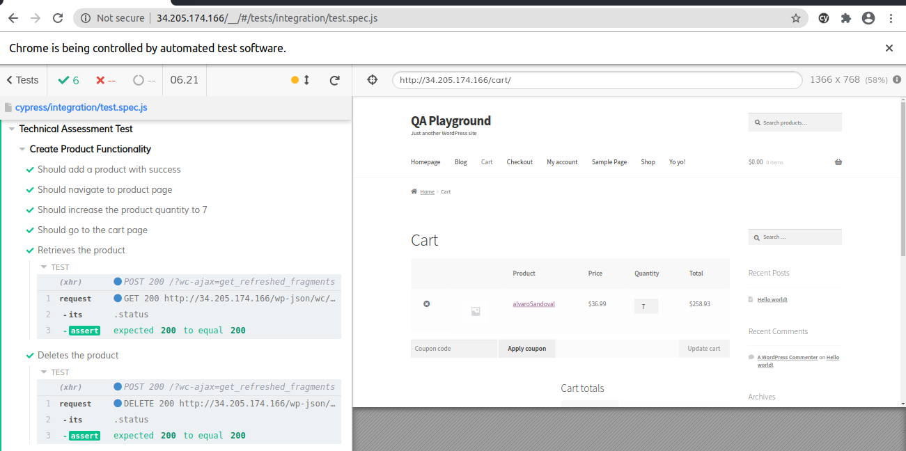
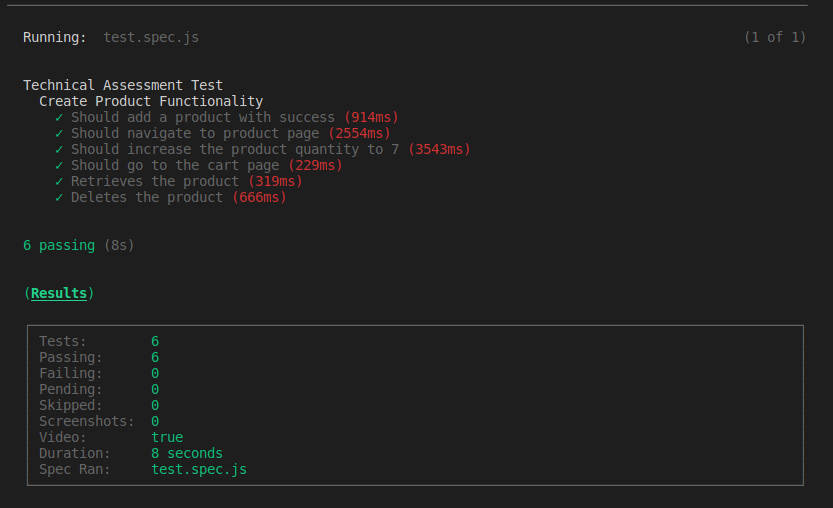

# Assessment

In this README.MD, you'll find a "**PART I**" section that describes how to run the first solution; and a "**PART II**" section with steps to execute the automated tests and some details regarding its components.

Note that the solution to both parts was implemented in *Javascript*, using *Nodejs* as runtime environment and *Cypress.io* as automation tool.

### Prerequisites
Before you get started, make sure you download and [install nodejs](https://treehouse.github.io/installation-guides/windows/node-windows.html) locally and test the node package manager (`npm`).


### Install Dependencies

Once you've **cloned the repo**, **downloaded nodejs** and tested **npm**, open a terminal in your workspace and run this command:

```bash
npm install
```


## PART I
For the solution to the proposed problem in this section, I used `Nodejs native modules` *(to prevent potential issues across Nodejs versions and community libraries)*.

Also, rather than using Javascript native built-in functions for iterating through the file-content-array (like for `map()`, `reduce()` or `filter()`), I used the conventional `for loop`. This is because, while investigating the differences between these options, when it comes to  performance in small data sets (5 - 1000 elements in length) the `for loop` is more efficient. Refer to these [super interesting research docs](https://github.com/dg92/Performance-Analysis-JS#results-for-small-data-set-of-array-size-5---1000) for further details. :nerd_face:

To **run the solution**, open a terminal in the root of the project and execute this command:

```bash
node first-item/challenge.js
```




For writing the **unit tests** I installed `mocha` as test runner and `chai` as assertion library. 

To execute the **unit tests**, run this command:

```bash
npm run test
```




## PART II
For this part, I used Cypress.io as automation tool. Cypress provides a basic structure that we can leverage to organize our project based on the 'nature' of the application under test. 

Although Cypress discourages the use of a **Page Objet Model** design pattern, I've found it useful to combine **page actions** and **page objects** (where possible) to write shorter and more readable tests. Following this approach also makes it easy to recycle **test methods** across multiple specs without having to modify each spec everytime maintance is required. 

So, as we can see in the structure below, we have one `test.spec.js` that imports methods/elements from the `product.page.js` and `cart.page.js`. Also, our spec file uses **custom commands**, which are registered globally (*within the Cypress context*) and don't depend on any type of page or flow, but are intended to be generic (these are a huge help). 

Finally, we have our **fixtures**, which we use to pass data into our specs. They can also be used to organize resources when testing a full API.

### Structure



### Execution steps
**First**, make sure that after you installed all the dependencies, Cypress installed properly. You can do that by running this command:

``` bash
$ npx cypress version
    Cypress package version: 4.9.0
    Cypress binary version: 4.9.0
```


Next, open Cypress  by running this command:

``` bash
npx cypress open
```



The Cypress console will pop-up displaying all the files within the **integration** folder. Select the one and only `test.spec.js`. You should see the test runner opening up in the browser and the test execution begin. 




You can also run the test **headlessly** with this command: 

``` bash
npx cypress run --spec cypress/integration/test.spec.js 
```



**Note**: if this is the first time you open Cypress, it may take a while for the console to pop up. Once it does, just navigate to the integration folder and select the `test.spec.js`

*If you have any issues while running any of the commands, I recommend visiting the [Cypress docs](https://docs.cypress.io/guides/guides/command-line.html#Installation).*


And that's it, you should be able to see test completing with success!!!:smiley:

